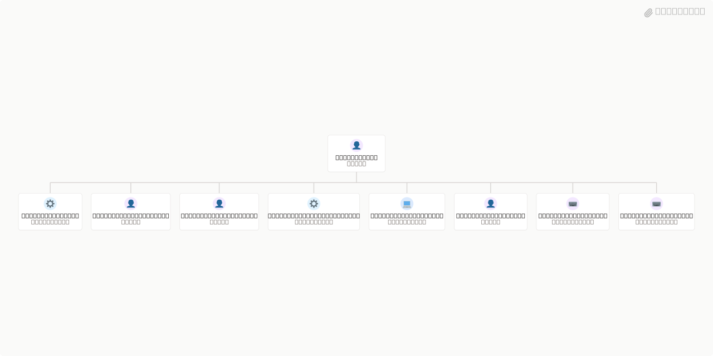

# Arch360



## What's Inside

> This is an [Agent Company](https://agentcompanies.io) package from [Paperclip](https://paperclip.ing)

| Content | Count |
|---------|-------|
| Agents | 9 |
| Projects | 1 |
| Skills | 8 |

### Agents

| Agent | Role | Reports To |
|-------|------|------------|
| Arch Master | general | — |
| Cloud Architect | devops | arch-master |
| Enterprise Architect | general | arch-master |
| Governance Architect | pm | arch-master |
| Infrastructure Architect | devops | arch-master |
| Principal Architect | CTO | arch-master |
| Security Architect | security | arch-master |
| Solution Architect | Engineer | arch-master |
| Technical Architect | Engineer | arch-master |

### Projects

- **Onboarding**

### Skills

| Skill | Description | Source |
|-------|-------------|--------|
| agentmail | Use your assigned AgentMail inbox to read email tasks, explicitly send or reply, and check delivery. Provided automatically by your inbox assignment. | [github](https://github.com/paperclipai/paperclip/tree/master/skills/agentmail) |
| first-task | Guide the user's first Paperclip task when its description invokes /first-task. Interpret the opening answer, clarify their goal, propose a plan or a single task, and wait for approval before hiring agents or executing approved work. | [github](https://github.com/paperclipai/paperclip/tree/master/skills/first-task) |
| paperclip-board | Manage a Paperclip company as a board member via chat. Use when the user wants onboarding, company or agent management, approvals, task monitoring, cost oversight, or work product review in the Paperclip control plane. | [github](https://github.com/paperclipai/paperclip/tree/master/skills/paperclip-board) |
| paperclip-converting-plans-to-tasks | Convert Paperclip plans into executable issue graphs. Use when asked to plan, scope, or break down Paperclip company work into assigned tasks with specialty fit, dependencies, blockers, and parallelization. | [github](https://github.com/paperclipai/paperclip/tree/master/skills/paperclip-converting-plans-to-tasks) |
| paperclip-create-agent | Create new agents in Paperclip with governance-aware hiring. Use when you need to inspect adapter configuration options, compare existing agent configs, draft a new agent prompt/config, and submit a hire request. | [github](https://github.com/paperclipai/paperclip/tree/master/skills/paperclip-create-agent) |
| paperclip | Use for Paperclip-managed tasks and heartbeats: reading task context, delivering task documents or files, updating completion or blockers, coordinating or delegating work, and following company governance. Includes control plane API operations for assignments, comments, approvals, and routines. | [github](https://github.com/paperclipai/paperclip/tree/master/skills/paperclip) |
| para-memory-files | Use a file-based PARA memory system to store, retrieve, and organize durable knowledge across sessions. Trigger on saving facts, daily notes, entity records, weekly synthesis, recall, tacit user patterns, or plan memory. | [github](https://github.com/paperclipai/paperclip/tree/master/skills/para-memory-files) |
| slack | Use the assigned Slack bot from Slack conversations, Paperclip tasks, and routines to read shared discussions and collaborate. | [github](https://github.com/paperclipai/paperclip/tree/master/skills/slack) |

## Getting Started

```bash
npx paperclipai company import this-github-url-or-folder
```

See [Paperclip](https://paperclip.ing) for more information.

---
Exported from [Paperclip](https://paperclip.ing) on 2026-10-05
