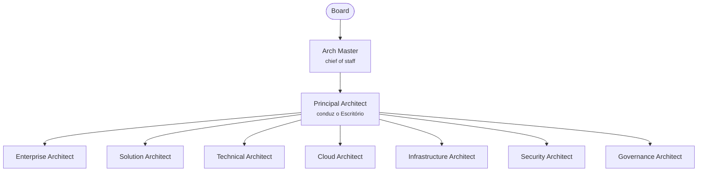

# Arch360

Escritório de Arquitetura de um banco brasileiro, operado por agentes no
[Paperclip](https://paperclip.ing). O Escritório produz ADRs e Referências de Arquitetura
(ARs) em pt-BR, ancorados no parque real do banco: um data center on-premises active-active,
OpenShift on-prem, Kubernetes na Azure, OCI e AWS, e AWS API Gateway, Azure APIM e Axway
coexistindo. Os artefatos citam BACEN/CMN, LGPD e PCI-DSS e vão para a revisão do comitê da
guilda de arquitetura do banco. Quem aprova é o comitê, nunca o Escritório.

> Este é um pacote [Agent Company](https://agentcompanies.io) do [Paperclip](https://paperclip.ing).

## Organograma



O organograma mostra a linha de reporte descrita nas instruções dos agentes: os sete
architects de domínio se reportam ao Principal Architect. No frontmatter (`reportsTo`),
porém, os sete ainda apontam para `arch-master`, e é esse campo que o Paperclip usa para
montar a cadeia de comando.

## Conteúdo

| Conteúdo | Quantidade |
|----------|------------|
| Agentes | 9 |
| Projetos | 1 |
| Skills distintas | 26 |

## Agentes

| Agente | Papel no Paperclip | Modelo | Responsável por |
|--------|--------------------|--------|-----------------|
| [Arch Master](agents/arch-master/AGENTS.md) | general | padrão do Codex | Ponto único de contato do board. Recebe pedidos, encaminha o trabalho de arquitetura ao Principal Architect e mantém o board informado. Único agente com heartbeat periódico (300 s). |
| [Principal Architect](agents/principal-architect/AGENTS.md) | cto | padrão do Codex | Barra de qualidade dos ADRs e ARs, prioridade do backlog, arbitragem entre domínios e último gate interno antes do comitê. |
| [Enterprise Architect](agents/enterprise-architect/AGENTS.md) | general | padrão do Codex | Mapas de capacidades e de domínios, estado-alvo, critérios de posicionamento de workload e padrões corporativos. |
| [Solution Architect](agents/solution-architect/AGENTS.md) | engineer | padrão do Codex | HLDs por iniciativa, integração entre on-prem e as três nuvens e autoria principal das ARs. |
| [Technical Architect](agents/technical-architect/AGENTS.md) | engineer | padrão do Codex | Workloads em OpenShift e Kubernetes, mix de API gateways, acesso a dados, NFRs e resiliência no nível de serviço. |
| [Cloud Architect](agents/cloud-architect/AGENTS.md) | devops | padrão do Codex | Azure, OCI e AWS: landing zones, serviços gerenciados, redes, resiliência e guardrails de custo. |
| [Infrastructure Architect](agents/infrastructure-architect/AGENTS.md) | devops | padrão do Codex | Data center active-active, domínios de falha, DR, capacidade e conectividade híbrida. |
| [Security Architect](agents/security-architect/AGENTS.md) | security | padrão do Codex | Identidade, segredos, chaves, criptografia, segmentação, escopo do CDE e o lado de segurança de BACEN/CMN, LGPD e PCI-DSS. |
| [Governance Architect](agents/governance-architect/AGENTS.md) | pm | padrão do Codex | Templates e ciclo de vida de ADR/AR, registro de decisões, entrada no comitê, waivers e rastreabilidade regulatória. |

### Harness

Todos os agentes rodam no adapter `codex_local` (Codex CLI) com o modelo padrão do adapter
(`gpt-5.6-sol` na versão atual do Paperclip), esforço de raciocínio `medium` e o sandbox
padrão do Codex (sem `dangerouslyBypassApprovalsAndSandbox`).

- **URL do gateway:** configurada fora do pacote, em `/etc/codex/config.toml`
  (`openai_base_url = "..."`), na máquina onde o Paperclip roda.
- **API key:** cada agente declara `OPENAI_API_KEY` como segredo. Depois do import,
  preencha a chave nas configurações de cada agente no Paperclip. Ela nunca fica no
  repositório.

### Arquivos de instrução de cada agente

Cada pasta em `agents/<agente>/` contém:

| Arquivo | Conteúdo |
|---------|----------|
| `AGENTS.md` | Identidade, regras de precisão e honestidade, contexto do banco, papel, fronteiras, entregas, critérios de pronto e linha de reporte. É o único arquivo injetado em toda execução. |
| `SOUL.md` | Postura, princípios e voz do agente. |
| `HEARTBEAT.md` | Checklist seguido a cada vez que o agente é acordado. |
| `TOOLS.md` | Skills disponíveis, referências regulatórias e referências do domínio. |
| `skills/` | As skills do agente, cada uma com `key` própria (`arch360/<agente>/<skill>`). |

## Skills

### Skills por agente

Todos os agentes têm `paperclip`, `para-memory-files` e as 10 skills de engineering
(listadas abaixo). Além delas:

| Agente | Skills adicionais |
|--------|-------------------|
| Arch Master | `paperclip-board`, `paperclip-converting-plans-to-tasks`, `paperclip-create-agent`, `first-task`, `stakeholder-update` |
| Principal Architect | `paperclip-converting-plans-to-tasks`, `fable-judge`, `roadmap-update` |
| Enterprise Architect | `archify`, `criterios-posicionamento` |
| Solution Architect | `archify`, `criterios-posicionamento` |
| Technical Architect | `archify` |
| Cloud Architect | `archify`, `criterios-posicionamento` |
| Infrastructure Architect | `archify`, `criterios-posicionamento` |
| Security Architect | `archify`, `threat-model-pci`, `regulatorio-bacen` |
| Governance Architect | `fable-judge`, `registro-adr`, `regulatorio-bacen` |

### Skills próprias do Escritório

| Skill | Descrição |
|-------|-----------|
| `threat-model-pci` | Modelagem de ameaças (STRIDE) com classificação de escopo do CDE e mapeamento para as famílias de requisitos do PCI DSS v4.0.1. |
| `regulatorio-bacen` | Checklist regulatório (Res. CMN 4.893/2021, LGPD, PCI-DSS) que gera a seção de conformidade de um ADR ou AR, obrigação por obrigação. |
| `criterios-posicionamento` | Procedimento comum para decidir entre data center, Azure, OCI e AWS. Traz uma matriz inicial que vale até o comitê aceitar um ADR com a matriz oficial. |
| `registro-adr` | Manutenção do registro de decisões: identificadores, transições de status, cadeia de substituição e waivers com vencimento. |

### Skills de terceiros incluídas

| Skill | Descrição | Origem | Licença |
|-------|-----------|--------|---------|
| `architecture` | Análise de opções e trade-offs para ADRs (a cópia local manda usar o template do Governance Architect). | Plugin engineering (Anthropic) | Apache 2.0 |
| `code-review` | Revisão de código quanto a segurança, desempenho e correção. | Plugin engineering (Anthropic) | Apache 2.0 |
| `debug` | Depuração estruturada: reproduzir, isolar, diagnosticar e corrigir. | Plugin engineering (Anthropic) | Apache 2.0 |
| `deploy-checklist` | Checklist de pré-implantação. | Plugin engineering (Anthropic) | Apache 2.0 |
| `documentation` | Documentação técnica, runbooks e documentação de API e arquitetura. | Plugin engineering (Anthropic) | Apache 2.0 |
| `incident-response` | Triagem, comunicação e postmortem de incidentes. | Plugin engineering (Anthropic) | Apache 2.0 |
| `standup` | Resumo de atividade no formato ontem/hoje/bloqueios. | Plugin engineering (Anthropic) | Apache 2.0 |
| `system-design` | Desenho de sistemas, serviços, APIs e modelagem de dados. | Plugin engineering (Anthropic) | Apache 2.0 |
| `tech-debt` | Identificação e priorização de dívida técnica. | Plugin engineering (Anthropic) | Apache 2.0 |
| `testing-strategy` | Estratégia e planos de teste. | Plugin engineering (Anthropic) | Apache 2.0 |
| `roadmap-update` | Priorização de roadmap em Now/Next/Later. | Plugin product-management (Anthropic) | Apache 2.0 |
| `stakeholder-update` | Atualizações de status por público e cadência. | Plugin product-management (Anthropic) | Apache 2.0 |
| `fable-judge` | Verificação adversarial de trabalho dado como pronto. | fable-method | MIT |
| `archify` | Diagramas de arquitetura, fluxo de dados, sequência e estado em HTML com SVG. Requer Node.js. | archify | MIT |

### Skills do Paperclip

| Skill | Descrição | Origem |
|-------|-----------|--------|
| `paperclip` | Tarefas, heartbeats, comentários, documentos de issue, delegação e aprovações. | [github](https://github.com/paperclipai/paperclip/tree/master/skills/paperclip) |
| `paperclip-board` | Gestão da company como board: agentes, aprovações, tarefas e custos. | [github](https://github.com/paperclipai/paperclip/tree/master/skills/paperclip-board) |
| `paperclip-converting-plans-to-tasks` | Converte planos em grafos de issues com donos, dependências e paralelismo. | [github](https://github.com/paperclipai/paperclip/tree/master/skills/paperclip-converting-plans-to-tasks) |
| `paperclip-create-agent` | Contratação de novos agentes com revisão de configuração e aprovação. | [github](https://github.com/paperclipai/paperclip/tree/master/skills/paperclip-create-agent) |
| `para-memory-files` | Memória persistente em arquivos no método PARA. | [github](https://github.com/paperclipai/paperclip/tree/master/skills/para-memory-files) |
| `first-task` | Conduz a primeira tarefa do usuário no Paperclip. | [github](https://github.com/paperclipai/paperclip/tree/master/skills/first-task) |
| `agentmail` | Caixa de e-mail do AgentMail. Incluída no pacote, sem agente atribuído. | [github](https://github.com/paperclipai/paperclip/tree/master/skills/agentmail) |
| `slack` | Bot do Slack. Incluída no pacote, sem agente atribuído. | [github](https://github.com/paperclipai/paperclip/tree/master/skills/slack) |

## Projetos

- **Onboarding**

## Como usar

```bash
npx paperclipai company import https://github.com/fbruandrade/arch360
```

Para mais informações, veja o [Paperclip](https://paperclip.ing).
